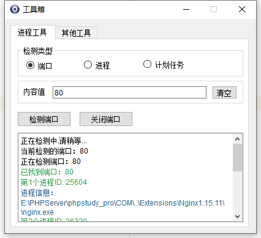
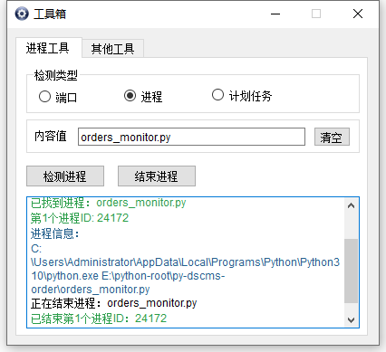

# py-tools
```
py-tools是一个集成工具集，将不断完善集成更多实用的小工具.
```


# 支持列表(不断更新中)
|   Name_EN   |    Name_CN     |
| :---------: | :------------: |
| psutil | 进程端口管理工具 |


# 安装

```

git clone https://github.com/lajox/py-tools.git
pip install -r requires.txt
```

# 快速启动
```python
python tool.py
```

#### 编译打包
```sh
pyinstaller.exe tool.spec
```

打包的目录在dist，编译打包完成后双击tool.exe即可运行

# Screenshot


